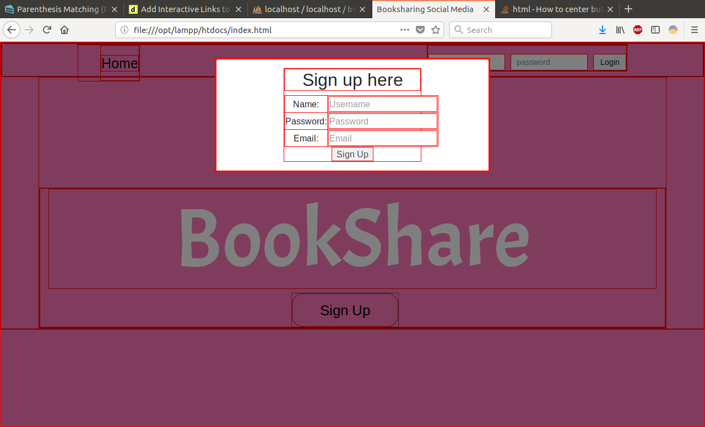

This is the bookshare app in progress.
Currently the project is hosted on my local server. I am using
xampp with Apache and MySql to store the user login information. I'm also
using MySql to store the comment section for the book reviews. Currently,
trying to figure out how to host this project on an AWS server.

